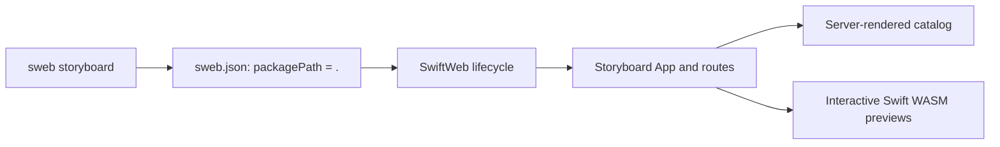

# SwiftWeb Storyboard

An interactive component catalog for [SwiftWeb](https://github.com/1amageek/swift-web).
Explore SwiftWebUI components in the browser, adjust their properties, and inspect
the Swift code and DOM behind each example.

Storyboard is a working SwiftWeb application: the catalog and documentation are
server-rendered, while interactive previews run as Swift WebAssembly client
components.

## Explore the catalog

Each component page brings together a live playground, usage snippets,
property documentation, and related components. Playground controls update the
preview and its generated Swift snippet. Light, dark, and automatic appearance
modes let you compare how examples look in different contexts.

| Area | Examples |
|---|---|
| Foundations | Grid, spacing, alignment, responsive layout, materials, and styling |
| Content and layout | Text, images, lists, sections, and grouped content |
| Controls and input | Buttons, menus, text fields, toggles, sliders, and pickers |
| Navigation and presentation | Navigation links, search, toolbars, alerts, sheets, and popovers |

The catalog also exposes DOM details and runtime diagnostics for investigating
rendering and client navigation. Browse the full catalog after starting the app,
or read its [information architecture](Sources/SwiftWebStoryboard/INFORMATION_ARCHITECTURE.md).

## Run locally

### Prerequisites

| Requirement | Version or purpose |
|---|---|
| macOS | 26.2 or later, as declared in `Package.swift` |
| Swift | `swift-6.4.x-DEVELOPMENT-SNAPSHOT-2026-08-14-a` |
| Swift SDK for WebAssembly | Matching `swift-6.4.x-DEVELOPMENT-SNAPSHOT-2026-08-14-a_wasm` SDK |
| Browser | A browser with WebAssembly support; the browser test uses Chromium |

Install the pinned compiler and matching SDK before starting. The
[SwiftWeb toolchain guide](https://github.com/1amageek/swift-web/blob/72fdf905469e3e6f38fc8c72e79e7200efd11159/docs/Toolchain.md)
defines the compiler, linker, and SDK configuration. `.swift-version` records the
Swiftly selector; it does not install the WebAssembly SDK.

### Start the application

With the pinned Swift toolchain selected and its matching SDK installed:

```bash
git clone https://github.com/1amageek/swift-web-storyboard.git
cd swift-web-storyboard
swift run sweb storyboard
```

Once the server reports ready, open **http://127.0.0.1:3000/storyboard**. The first
run resolves dependencies and builds the CLI, browser runtime, and server, so it
can take several minutes. Stop the server with **Control-C**. If port 3000 is in
use, choose another port with `--port`.

SwiftPM builds `sweb` from the pinned SwiftWeb dependency. You do not need a
separate SwiftWeb checkout or a globally installed CLI.

## Commands

Run these from the repository root.

| Command | Result |
|---|---|
| `swift run sweb storyboard` | Start the development server |
| `swift run sweb storyboard prepare` | Prepare the application's generated packages |
| `swift run sweb storyboard build` | Build server and browser artifacts for the configured local environment |
| `swift test` | Run the native catalog tests |

Generated packages and runtime artifacts live under `.swiftweb`; SwiftPM build
products live under `.build`. Application changes belong in `Sources`, not in
those generated directories. `build` produces artifacts; it does not start a
production server or deploy the application.

## How it fits together



This repository owns the App, catalog content, routes, and application tests.
SwiftWeb owns rendering, browser runtime, package generation, and process
management. The package depends on a pinned public SwiftWeb commit; SwiftWeb has
no package dependency on Storyboard.

[`sweb.json`](sweb.json) selects this package with `storyboard.packagePath: "."`
and declares its application identity and local environment. The CLI consumes
that [selection contract](https://github.com/1amageek/swift-web/blob/72fdf905469e3e6f38fc8c72e79e7200efd11159/Sources/SwiftWebCLI/DESIGN.md)
without knowing the catalog's page types or source layout.

## Develop and verify

| Location | Responsibility |
|---|---|
| [`App.swift`](Sources/SwiftWebStoryboard/App.swift) | Application scenes and root redirect |
| [`Routes/`](Sources/SwiftWebStoryboard/Routes) | Catalog routes |
| [`Catalog/`](Sources/SwiftWebStoryboard/Catalog) | Examples, metadata, playground controls, and snippets |
| [`Tests/SwiftWebStoryboardTests/`](Tests/SwiftWebStoryboardTests) | Rendering, catalog structure, style policy, and hydration dispatch tests |
| [`Tests/BrowserE2E/`](Tests/BrowserE2E) | Real-browser navigation and runtime tests |

When adding or changing an example, keep its registry entry, preview, controls,
and usage snippet consistent. Run the native tests, and run the browser gate
when changing interaction, routing, or hydration. See [DESIGN.md](DESIGN.md) for
component boundaries and verification ownership.

### Browser tests

With the pinned toolchain selected and Node.js and npm available, run:

```bash
cd Tests/BrowserE2E
npm ci
npx playwright install chromium
npm run storyboard-navigation
```

The runner builds the CLI, starts the application on an available local port,
and checks sidebar navigation, browser back/forward, appearance persistence,
native hash and external links, runtime reuse, and browser diagnostics. It stops
the server and removes generated `.swiftweb` output afterward.

## License

[MIT](LICENSE).
